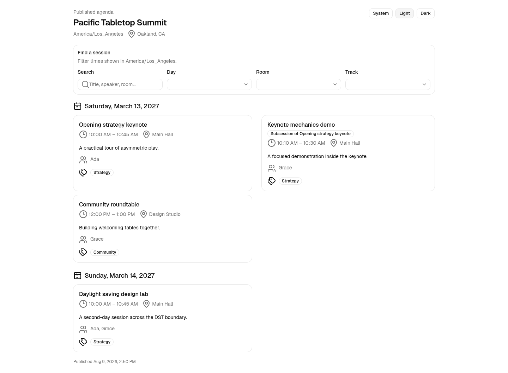

# Board to Death

Board to Death is a self-hosted conference program workspace. Program teams can open a call for proposals, review
submissions, onboard accepted speakers, build an agenda, publish attendee-facing program views, and preview an
Accelevents sync from one event-scoped dashboard.



The application uses Next.js 16, React 19, TypeScript, PostgreSQL, Prisma, Tailwind CSS, and shadcn/ui. It supports an
English-language workflow for organizers, applicants, reviewers, and speakers.

## Supported workflow

- Organizers create an event, including its time zone, rooms, tracks, CFP categories, and access settings.
- Applicants submit an abstract or guaranteed session through a published CFP link. Form versions preserve the exact
  questions and answers used for each submission.
- Organizers track prospective speakers in a stage pipeline and collect leads through a published interest form.
- Reviewers score assigned submissions in identified, blind, or anonymized rounds. Organizers compare weighted results,
  advance submissions, and record waitlist, acceptance, or rejection decisions.
- Accepted participants confirm their invitation and enter the speaker portal. They update profiles, upload files,
  complete onboarding tasks, and read event resources.
- Organizers promote accepted submissions into sessions, resolve schedule conflicts, publish an immutable program
  snapshot, and share agenda, session, speaker, and itinerary embeds.
- Organizers map consented speaker profiles and published sessions to Accelevents, inspect each proposed remote action,
  and run the deterministic adapter supplied with this repository.

Read the [user guide](docs/user-guide.md) for role boundaries, links, validation rules, state changes, recovery steps,
exports, and the complete program journey. Operators should also read [production operations](docs/operations.md).

## Product scope

The current release includes event-scoped CFPs, evaluation, speaker sourcing, speaker onboarding, contacts and
sponsor or exhibitor groups, scheduling, communications, file requests, reports, public resources, published-program
APIs, embeds, and the deterministic Accelevents adapter.

The following capabilities are outside the supported release:

- Payments, ticketing, invoicing, refunds, and payment-provider integrations
- Multilingual forms, content, messages, or translation workflows
- AI-generated review comments, AI scoring, and prompt-driven dashboards
- CRM and marketing automation, including Airtable synchronization
- Public sponsor or exhibitor group portals
- Cloudflare-specific deployment or storage integration
- Laravel Forge deployment automation
- A live Accelevents HTTP adapter

Vercel and self-hosted Node deployments are documented. Cloudflare or Forge may host surrounding infrastructure, but
the repository contains no provider-specific integration for either service.

## Run locally

Use Node 24.19.0 and npm 11.17.0. PostgreSQL 16 must be available.

```sh
nvm use
cp .env.example .env
npm ci
npm run db:deploy
npm run dev
```

Open <http://localhost:3000>. Authentication uses magic links. Dashboard access comes from active organization or
event memberships, not from an email allowlist.

Seed a repeatable demonstration event with:

```sh
npm run db:seed
```

The seed replaces only the `board-to-death-demo` event and uses stable IDs. It creates no login account or password.
See [production operations](docs/operations.md#seed-and-demo-access) for the fixture contents and security notes.

## Database commands

Keep `DATABASE_URL` separate from `TEST_DATABASE_URL`. Test database commands reject a database whose name does not end
in `_test` and reject a test URL that resolves to the application database.

```sh
npm run db:generate
npm run db:migrate -- --name NAME
npm run db:deploy
npm run db:status
npm run db:test:reset
npm run db:test:smoke
```

Commit `prisma/schema.prisma` and each generated migration directory together. Deployments use `db:deploy`; developers
use `db:migrate` to create migrations.

## Checks

```sh
npm run check
npm run typecheck
npm run test
```

Run focused repository or browser tests when a change touches those contracts. Browser tests use the development
server and a guarded test database:

```sh
npm run db:test:reset
PLAYWRIGHT_WEB_SERVER_COMMAND="npm run dev -- --hostname 127.0.0.1 --port 3100" npm run test:browser
```

See [CONTRIBUTING.md](CONTRIBUTING.md) for the contribution workflow.
