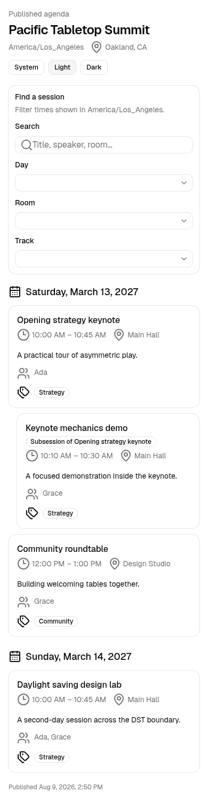

# Board to Death user guide

Board to Death manages a conference program from CFP setup through publication. Each event owns its forms, contacts,
reviews, sessions, files, communications, and integration history. Select the correct event in the dashboard before
you edit records or send messages.

This guide covers the supported English-language release. Your deployment origin replaces `https://events.example.com`
in the example links.

## Roles and entry points

| Person | Entry point | Access boundary |
| --- | --- | --- |
| Organizer | `/auth/v1/login`, then `/dashboard` | The deployment allowlist admits the user. An organizer can manage each event. |
| CFP owner or editor | `/dashboard/events/{eventSlug}/cfp` | A per-form assignment controls form setup. `OWNER` and `EDITOR` can edit; `REVIEWER` has review-oriented access. |
| Reviewer | `/reviews` | A reviewer sees active assignments issued to that identity and cannot open another reviewer's assignment. |
| Applicant | `/cfp/{publicId}` | The published policy controls dates, access, drafts, limits, questions, and messages. No admin session is required. |
| Speaker | `/portal/{eventSlug}/sign-in` | A short-lived, event-scoped speaker link grants access only to that speaker's submissions, tasks, profile, and files. |
| Prospective speaker | `/speaker-interest/{publicId}` | A published interest form accepts contact details for the event's sourcing pipeline. No admin session is required. |
| Attendee | `/embed/{eventSlug}` or `/events/{eventSlug}/resources` | Attendees see the latest published program snapshot and published resource pages. |

Magic-link delivery is not email-allowlisted. Dashboard and event access come from active organization and event
memberships; event authorization then checks organizer, reviewer, applicant, or speaker ownership for the requested
resource. A missing or unauthorized event-owned record returns the same not-found response so one event cannot reveal
another event's IDs.

## Organizer journey

### 1. Create and select an event

Open `/dashboard/event-settings` and create the event. Supply its name, slug, type, start and end dates, and IANA time
zone. Add the location, website, theme, rooms, tracks, and CFP categories that the program needs.

The time zone is required. The dashboard, agenda, embeds, public API, and exports store instants in UTC and render them
in the event's time zone. Check the event switcher before editing. Event-scoped pages reject a slug that does not match
the active event instead of moving data between events.

Use `/dashboard/events/{eventSlug}/overview` to monitor submissions, participants, evaluation progress, incomplete
speaker profiles, overdue tasks, and accepted sessions without agenda placements. Each metric links to a filtered
workspace where the organizer can act on the records.

### 2. Build and publish a CFP

Open `/dashboard/events/{eventSlug}/cfp`, create a draft, and enter its setup workspace. Configure:

- Form title, welcome copy, instructions, submission kind, and open or restricted access
- Versioned steps and questions, including required fields, constraints, conditional visibility, and category routing
- Submission and confirmation windows in the event's time zone
- Draft policy and per-speaker or per-submission limits
- Introduction, confirmation, closed, and thank-you messages
- Per-form owners, editors, and reviewers

Preview the form before publication. Publishing locks the chosen form version into the public policy and exposes
`/cfp/{publicId}`. Later edits create a new form version; existing revisions retain their original definition snapshot.

CFP policy states follow this path:

`Draft -> Published -> Closed -> Published` or `Closed -> Archived`

Close a CFP to stop new submissions while preserving records. Reopen it when its configured dates permit access.
Archive it when the program team no longer needs the public link. Duplicate a form when you need a new draft based on
an existing setup.

### 3. Monitor applicants and submissions

Open `/dashboard/events/{eventSlug}/submissions`. Search and filter by status, kind, category, or assignee. Choose table
columns, save the current view, and export the same filtered result as CSV or XLSX. Reset the saved view when the team
needs the default columns again.

Submission states are:

`Draft -> Submitted -> Under review -> Waitlisted/Accepted/Rejected -> Confirmed`

Administrators can inspect each submitted revision, participants, routed categories, and transition history. A saved
draft does not enter review. A final submission records a new immutable revision. Acceptance creates the invitation
path; the submission reaches `Confirmed` after each invited participant confirms.

The admin intake workspace at `/dashboard/events/{eventSlug}/sessions/intake` can create submissions and sessions for
content received outside the public CFP. Download its CSV template, preview a file before applying it, and correct all
row errors before import. The import rejects the batch rather than applying a partial file.

### 4. Run evaluation rounds

Open `/dashboard/events/{eventSlug}/evaluations` and create an evaluation plan. Add ordered rounds and weighted rubric
criteria. A round starts as `Planned`; its title, key, visibility mode, ordering, and rubric remain editable while the
plan version is a draft.

Choose one reviewer visibility mode:

- Identified: the reviewer sees applicant identity and proposal content.
- Blind: the reviewer sees proposal content without applicant identity.
- Anonymized: the reviewer sees an opaque submission label and no applicant identity.

Opening a round snapshots the visibility mode and rubric. The lifecycle is
`Planned -> Open -> Closed -> Archived`. Organizers cannot edit an opened snapshot. Closing stops reviewer work;
archiving keeps the history immutable.

Use `/evaluations/assignments` to add or revoke reviewers. The workspace blocks duplicate active assignments. Reopen a
completed evaluation when a reviewer needs to correct it; the reviewer can save and submit a new final result after
the reopen.

Use `/evaluations/results` to compare criterion averages, weighted scores, rankings, recommendations, and completion.
Advance a fully reviewed submission to the next round. In the final round, record `Waitlisted`, `Accepted`, or
`Rejected`. A decision stores its sequence number and history, so a later decision does not erase the earlier one.

### 5. Invite and onboard speakers

After acceptance, choose **Invite speakers** in evaluation results. Each participant receives a confirmation link. A
successful confirmation links the participant to the event speaker portal and contributes to the submission's
confirmation count. Reissue invitations when a link expires or a participant did not receive it.

Create task definitions in `/dashboard/onboarding-tasks`, then use
`/dashboard/events/{eventSlug}/onboarding` to assign them and manage due dates. Task states follow:

`Pending -> Submitted -> Approved`

An organizer can request a revision, which moves submitted work to `Revision requested`; the speaker can submit a new
attempt. An organizer can also withdraw an assignment. File attempts remain in the audit history. Reminder rules can
target due or overdue work, and a speaker can opt out when the rule permits it.

Use `/dashboard/events/{eventSlug}/speakers` for the speaker matrix, profile completeness, task filters, and CSV export.
The biography, headshot, consent, and task indicators help the team fix publication blockers before publishing.

### 6. Build sessions and schedule the agenda

Accepted submissions can produce promoted sessions. Organizers can also create manual or guaranteed sessions in
`/dashboard/events/{eventSlug}/sessions`. Set the title, description, duration, track, and ordered participants with
speaker, moderator, or chairperson roles.

Open `/dashboard/events/{eventSlug}/agenda` to place sessions into rooms. The scheduler detects:

- A placement outside the event boundary
- Overlapping use of a room, track, or speaker

The default conflict policy prevents the save. An organizer may choose the explicit-confirm policy and confirm a
known overlap. Stale edits fail an expected-version check; reload the agenda and reapply the change against the latest
placement. Remove an incorrect placement to return the session to the unscheduled list.

The agenda workspace offers timeline, room, and conflict views. Filters carry into the CSV export at
`/dashboard/events/{eventSlug}/agenda/export`. Times in the file include the event's local representation and UTC
instant.

### 7. Publish the program and embeds

Publish from the agenda workspace after the schedule and speaker consent are ready. Publication creates an immutable
snapshot of the event, rooms, tracks, consented speaker profiles, scheduled sessions, and placements. Later admin edits
do not alter the public view until an organizer republishes. Unpublish to take all public program views offline while
retaining version history.

The embed builder at `/dashboard/events/{eventSlug}/publishing/embeds` previews and copies iframe or web-component
snippets. It supports agenda, session list, attendee itinerary, speaker list, and speaker gallery widgets. Each widget
accepts allowlisted theme, density, and filter options. The generated script resizes the host element as its content
changes.

Direct public links include:

- `/embed/{eventSlug}?kind=agenda` for the agenda
- `/embed/{eventSlug}?kind=session-list` for sessions
- `/embed/{eventSlug}?kind=itinerary` for an attendee's browser-local itinerary
- `/embed/{eventSlug}?kind=speaker-list` and `kind=speaker-gallery` for speakers
- `/events/{eventSlug}/resources` for published resource pages

The itinerary stores selections in the attendee's browser. Exported calendar content uses the published schedule; it
does not create an attendee account.

Public JSON endpoints use the event ID:

- `/api/v1/events/{eventId}/agenda`
- `/api/v1/events/{eventId}/sessions`
- `/api/v1/events/{eventId}/speakers`

These read-only endpoints serve the latest published snapshot and allow cross-origin GET requests. An unpublished or
unknown program returns no private draft data. `OPTIONS` supports browser preflight requests.

### 8. Preview the Accelevents handoff

Open `/dashboard/events/{eventSlug}/integrations`. An event-scoped configuration names the remote event and stores a
credential reference such as `env://ACCELEVENTS_API_KEY`; it does not store the credential value.

Map consented speaker fields, then inspect each preview row. Rows report `Create`, `Update`, `Unchanged`, `Skipped`, or
`Invalid`; private profiles withhold outbound fields. Download the authorized speaker CSV when the team needs a file
review.

Session mapping reads the latest published program snapshot. Map title, description, room, schedule, and speaker
references, then inspect the session preview or download its CSV. Publish or republish the program when the preview
reports that no snapshot exists.

Start a push after the preview has no unexplained invalid records. The sync log records run and per-record status,
remote IDs, explanations, attempts, and retry eligibility. A run can finish as `Succeeded`, `Partially failed`,
`Failed`, or `Cancelled`. Cancel a pending or running batch to stop records that have not started. Retry only the rows
marked eligible and wait until their retry window opens.

The repository supplies `DeterministicAcceleventsAdapter`. It creates stable fake remote responses for tests and demo
data. No live Accelevents HTTP adapter or deployment credential resolver ships with this release.

## Applicant journey

Open the organizer's `/cfp/{publicId}` link. The landing page shows the event, open or closed state, introduction, and
submission rules. Choose **Start submission** while the policy window is open.

Complete each visible required question and add the required participants. Conditional questions appear after their
source answer matches. The server repeats all browser validation, including text lengths, numeric bounds, option
membership, dates, URLs, email shape, participant limits, and required consent.

If drafts are allowed, save and return with the draft link. A draft policy may require a draft or disable drafts. The
final action creates a submitted revision and shows the configured confirmation or thank-you message. A double submit
does not create a second proposal.

Common recovery steps:

- Closed message: ask the organizer to check the policy dates or reopen the CFP.
- Required or invalid answer: fix the field named beside the message; other answers remain on the page.
- Expired draft link: ask the organizer for the current public CFP link. Draft access cannot cross events.
- Submission limit reached: ask the organizer to review the policy rather than changing the applicant email.

Applicants do not enter the speaker portal until an organizer accepts the submission and issues participant
invitations.

## Reviewer journey

Sign in through the admin magic-link page with the email assigned to the review. Open `/reviews` and choose an active
assignment. Closed rounds and revoked assignments leave the list.

Enter criterion scores, optional criterion notes, overall feedback, and a recommendation. **Save draft** preserves a
partial review. **Submit final** requires a score for each required criterion. A final review becomes read-only until
an organizer reopens it.

Blind and anonymized assignments suppress applicant identity in the rendered review. Do not copy applicant details
from other systems into notes for those rounds. If an assignment returns not found, verify the signed-in email and ask
the organizer to confirm the assignment and round state.

## Speaker journey

Open the invitation link after acceptance. Confirmation signs the participant into the event-scoped portal and lands
on `/portal/{eventSlug}`. The portal shows submissions, profile status, tasks, scheduled sessions, and published
resources for that speaker.

Use **Profile** to update names, biography, organization, job title, website, pronouns, publication consent, and contact
consent. Upload headshots and agreements only in the formats named by each control. The server checks file size,
declared content type, and file signature. Replace or remove the file from the same control.

Use **Submissions** for the speaker's own accepted content and to manage supported presentation files. Another
speaker's submission or file route returns not found. Use **Tasks** to answer text, file, or form assignments. A
revision request opens a new attempt without deleting earlier work.

Use **Resources** for organizer-published pages. Draft, unpublished, or archived pages do not appear. If the portal
link expires, return to `/portal/{eventSlug}/sign-in` and request a new link. Sign out on a shared device.

## Other admin workspaces

- Contacts: link event contacts to directory people and inspect event-scoped records.
- Sponsor and exhibitor groups: manage groups, contacts, primary contacts, and ordered tiers in the admin dashboard.
- File requests: assign a request to a contact, group, or submission; track pending, fulfilled, or withdrawn status;
  download authorized files; export status.
- Communications: create email templates, filter an audience, confirm a bulk delivery, inspect attempts, and cancel
  queued recipients.
- Bulk edit: preview and apply event-scoped contact, session, or group changes in
  `/dashboard/events/{eventSlug}/records`.
- Reports: create saved reports over sessions, contacts, groups, or evaluation plans; filter rows; duplicate a report;
  export the displayed result as CSV or XLSX.
- Custom dashboards: start from an event, submissions, speaker, review, evaluation, or schedule template and arrange
  metric, chart, or list widgets. The dashboard uses stored definitions and does not generate layouts from prompts.

## Speaker sourcing

Use `/dashboard/events/{eventSlug}/speaker-sourcing` to build a pipeline of prospective speakers before or alongside
the CFP. Configure the ordered stages the event needs; each event keeps exactly one stage per behavior, covering open,
nurture, won, and lost.

Publish an interest form to collect prospects from outside the dashboard. The public link is
`/speaker-interest/{publicId}`; an unpublished or unknown form returns not found. Organizers can also enroll a
directory person directly. Each prospect records its source form or manual label, and a person can appear once per
event pipeline.

Move a prospect between stages, add notes, and assign the prospect to the event. Every creation, stage change, note,
and assignment is stored as prospect activity, so the pipeline keeps its own history. Assignment links the prospect to
this event; it does not create a submission or a speaker portal session, which still come from the CFP and invitation
flow described above.

## Scope and deliberate exclusions

| Capability | Decision in this release |
| --- | --- |
| Cloudflare | No Cloudflare Pages, Workers, R2, DNS, or Access integration. Deploy the standard Node application behind a reverse proxy or use the documented Vercel path. |
| Laravel Forge | No Forge recipe or deployment automation. Use the self-hosted Node/Incus instructions in `docs/operations.md`. |
| Airtable | No import, export, or synchronization adapter. Use the supported CSV/XLSX workspaces or public JSON endpoints. |
| AI-prompt dashboard | Excluded. Organizers choose stored dashboard templates, data sources, and widget layouts. |
| Group portal | Excluded. Organizers manage sponsor and exhibitor groups in the authenticated dashboard; the release has no public group login or workspace. |
| Payments | Excluded. The application does not collect fees, sell tickets, create invoices, or store payment details. |
| Multilingual content | Excluded. Forms, validation, messages, and user documentation support English. |
| AI-assisted review | Excluded. Reviewers enter scores and notes; the application does not generate or rank review text with AI. |
| CRM and marketing | Excluded. Contacts and bulk messages support program operations, not sales pipelines, campaigns, or marketing automation. |

Do not use the legacy template dashboards as evidence of a supported payment, CRM, marketing, finance, or commerce
workflow. They remain starter-template screens outside the Board to Death program product.
